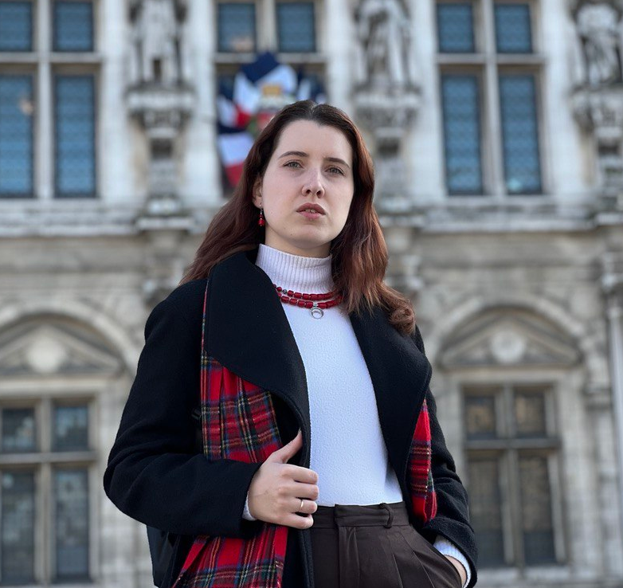

<!--<h1 style="color:Tomato;text-align:justify;">Machine Learning and Natural Language Processing research</h1> -->
<!--<p.main-text style="margin-top:10px;text-align:justify;"></p.main-text>-->
<!--

-->

<h5>Here you can check my <a href="https://olha-kaminska.github.io/Kaminska_Olha_CV.pdf">CV</a> or take a look on my <a href="https://olha-kaminska.github.io/blog.html">list of papers</a>.</h5>

<h2>About me</h2>

 Hi, my name is Olha Kaminska, I am a Ph.D. student at Ghent University and ML/NLP researcher.

 My main focuses since my master's studies were machine learning and data analysis. My particular specialization is in natural language understanding, where I have publications, work experience, several
public speeches, and study projects. Currently, my research area is about an application of fuzzy-rough-based nearest-neighbours approaches to the labelled Twitter data to detect emotions (hate, sarcasm, joy, etc.) in an explainable way.

  

  
 
<h4>My fields of interest:</h4>

  <ul>
    <li>Natural Language Understanding</li>
    <li>Emotion Detection and Sentiment Analysis</li>
    <li>Machine Learning methods for NLU</li>
  </ul>

<h2>Short biography</h2>

I received Bachelor's degree in System Analysis at the National Technical University of Ukraine “Kyiv Polytechnic Institute” (2017) and Master's degree in Computer Science at Tartu University (2019). I have work experience related to text processing as a Junior Data Scientist in Ukrainian and Estonian startups.

Currently, I am an interdisciplinary Ph.D. student in Computational Web Intelligence (CWI) lab and LT3 (Language and Translation Technology Team) group at Ghent University. Topic of my thesis is "Machine Learning Methods for Sentiment Analysis and Emotion Detection".

<h4>Links:</h4>

  <ul>
    <li>
Some of my projects: <a href="https://github.com/olha-kaminska">on my GitHub page</a>.
 </li>
    <li>
My Ghent University pages: <a href="https://cwi.ugent.be/research/team/olha-kaminska.php">CWI</a> and <a href="https://www.lt3.ugent.be/people/olha-kaminska">LT3</a> labs.
 </li>
  </ul>

<h2>Contact me</h2>

  <ul>
    <li><a href="https://www.facebook.com/olha.kaminska.399">Facebook</a></li>
    <li><a href="https://www.linkedin.com/in/olha-kaminska-97027513a/">LinkedIn</a></li>
    <li>

  ✉️ Olha.Kaminska@uGent.be

</li>
  </ul>

